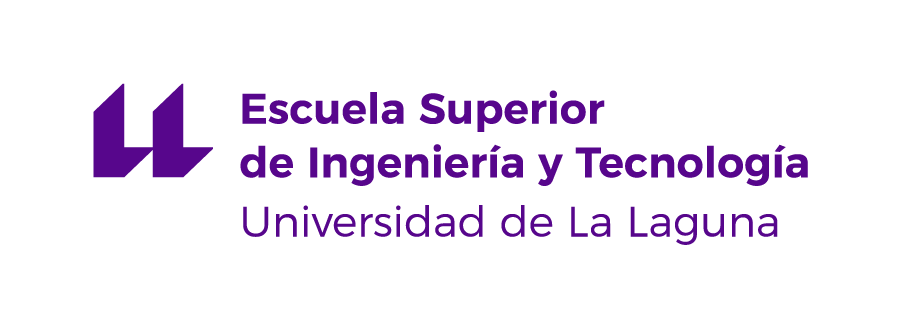

\
Máster Universitario en Ingeniería Informática\
Trabajo Fin de Máster

------------------------------------------------------------------------

*GH2GR: Github Classroom as a data source for GoRace*

------------------------------------------------------------------------

La Laguna, 7 de Julio de 2024

------------------------------------------------------------------------

- [Browsable PDF ](https://github.com/gh-cli-for-education/TFM-GH2GR-Claudio-Nestor-Yanes-Mesa/blob/memorias/TFM_GH2GR_Claudio_Nestor_Yanes_Mesa-navegable.pdf)
- [Signed PDF](https://github.com/gh-cli-for-education/TFM-GH2GR-Claudio-Nestor-Yanes-Mesa/blob/memorias/TFM_GH2GR_Claudio_Nestor_Yanes_Mesa%20_firmado.pdf)
- [Branch `memorias` of the GitHub Repository](https://github.com/gh-cli-for-education/TFM-GH2GR-Claudio-Nestor-Yanes-Mesa/tree/memorias) 